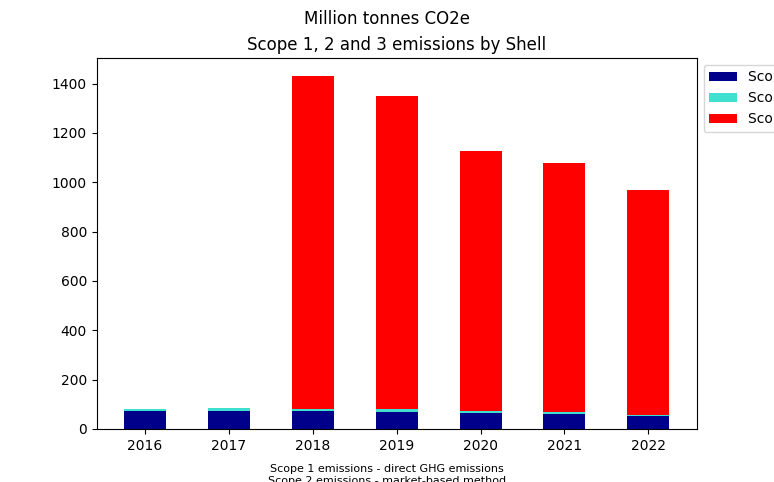

# Backlog
Ideas I want to pursue

- [ ] "Base" Python3 Settings to run all projects (jupyter, shutil, pandas, etc.)

---

# 💡 DATA IDEAS

# E-Fuels are Bullshit
When you want to power the worlds cars...

## 💡 IDEA
Use sources from E-Fuels lobbyists, governments sources, and interest groups to educate people about E-Fuels, it's usecases and why using it in cars as a widespread solution is among the worst ideas since the prohibition in America.
- Calculator calulating the required amounts of electricity, given variable inputparameters...

## 🧩 Reasoning
There is some talk about E-Fuels in Germany rn.
History repeats, Europeans using a ruler to divide africa, we see the same 💩 again, people arguing producing the E-Fuels in northern Africa, because there is lots of sun.

# Shell Greenwashing
Take Climate Actions by companies:
[Shell plc]:
> Target to become a net-zero emissions energy business by 2050

There are people, investors, bankers, people we trust with money reading this and thinking everything will be fine. I mean "net zero emissions", that's green, right?

No.

Net-Zero means eliminating your `Scope 1` and `Scope 2` emissions. `Scope 3` are the emissions due to your products sold!

In [[Shells]]'s "Achieving net-zero emissions" chapter there is a brief explanation what those three emission-categories are.
Then follows more wasted paper then rubbish explanations then when I complain about stuff in writing!
Shell boasts about their great efforts and go out of their way to show you lower emisison charts like this one:

I could explain how this is missleading in many ways, but chose to fix the chart instead!

Eliminating your `Scope 1` and `Scope 2` emissions would reduce the emissions `Shell` only about 5%.

How is that for

> doing business in an ethical and transparent way.

and supporting

> the more ambitious goal of the Paris Agreement [limiting global temperature rise to] 1.5 degrees

Well, more than 12 pages bousting about energy transition and downtrending graphs don't seem so relevant now, do they?

But this is the information your fund-manager, bank personal selling you a climate concious product or journalists will use to tell a diffrent story!

Funny how the whole webpage on "Greenhouse gas emissions" nor Shells published Sustainability reports don't include a single graphic visualizing the `Scope 3` emissions.
Meanwhile their "Sustainability Report" webpage let's you generate multiple charts... on their webpage!

🔗 URL: https://reports.shell.com/sustainability-report/2022/_assets/downloads/shell-sustainability-report-2022.pdf

Greenhouse gas emissions
🔗 URL: https://www.shell.com/sustainability/transparency-and-sustainability-reporting/performance-data/greenhouse-gas-emissions.html

